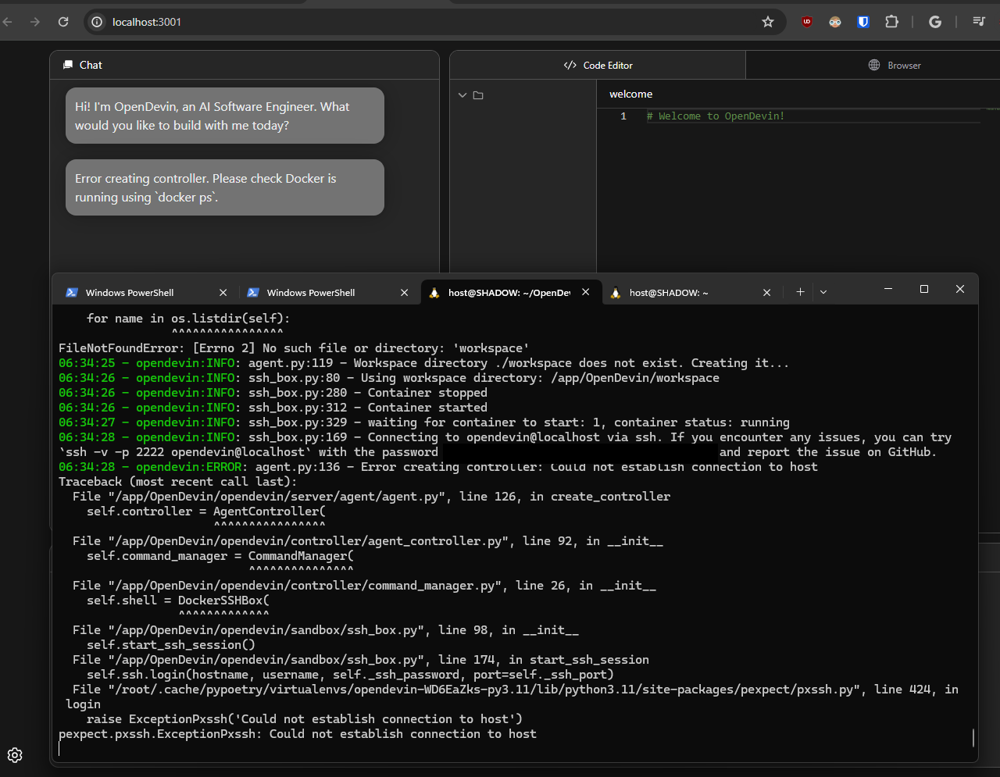

# OpenDevin Docker

Builds and runs a Docker instance of the [OpenDevin](https://github.com/OpenDevin/OpenDevin) project

## Notes

### 04/12/2024
Currently, the Dockerfile is cloning my fork of OpenDevin due to the Makefile requiring a non-Docker build. This means you should not start the Docker container with "make build" as you cannot have a Docker container inside another Docker container. The sandbox Docker container for OpenDevin is pulled in the run script. I will update the Dockerfile to use the non-forked version if the pull request gets approved on the main repository.

### 04/13/2024
Working on getting both the sandbox docker and OpenDevin docker to talk to each other. Will require modifications of OpenDevin and how it starts the sandbox docker. Working on it through my fork but we are almost there

## Run

### Windows
Use **run_opendevin.ps1**

Windows is currently having networking issues. 3001 doesn't seem to be reachable and looking for a solution.

### Linux/MacOS
Use **run_opendevin.sh**

